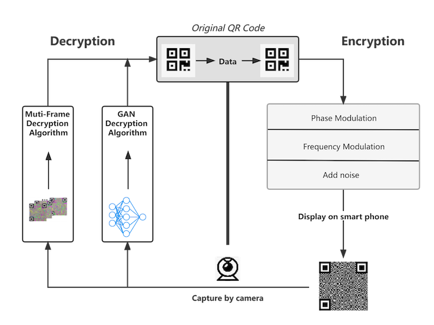
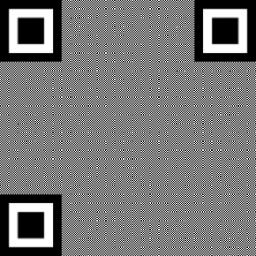

# CS339-Project
Course Project for CS339: Computer Networks🤗.

## Abstract
Quick Response (QR) codes have become universal in our life due to their rapid readability and the popularity of smartphones with built-in cameras. However, researchers have found that QR codes are vulnerable to various kinds of attacks (e.g. replay attack), which may lead to huge financial loss and private information leakage. To resist such attacks as well as maintaining QR codes' convenience, we follow [mQRCode](https://dl.acm.org/doi/10.1145/3300061.3345428)'s work and propose `Eff-mQRCode`, which exploits Moiré pattern to hide QR codes from an inappropriate position. In addition, we propose a GAN-based decryption method and do comprehensive experiments to prove its validity. The experiments illustrate that our decryption method is more robust to different environments and can achieve much shorter decryption time than the original multi-frame decryption method.

## Pipeline
Generally, our system pipeline is shown in the figure below. First, we encode data in the form of QR codes. Then we encrypt the QR codes through phase modulation, frequency modulation and adding noise. For decryption, we capture photographs at a right position and decode them using multi-frame algorithm or feeding them into our pretrained GAN. Ultimately, we can get the data from the decrypted QR codes.


## Environment
- anaconda, python=3.8
- opencv-python (pip install opencv-python)
- conda install pytorch==1.8.0 torchvision==0.9.0 torchaudio==0.8.0 cudatoolkit=11.1 -c pytorch -c conda-forge -c nvidia
- pip install pillow
- pip install dominate
- pip install visdom
- ffmpeg

## Run Experiments
- Train: python train.py --dataroot ./datasets/qrcode --name deblurPix2PixGAN --model deblurQr_pix2pix_gan  --batch_size 1 --resize_or_crop scale_width_and_crop --no_flip
- Test: python test.py --dataroot ./datasets/qrcode --name deblurPix2PixGAN --model deblurQr_pix2pix_gan  --batch_size 1 --resize_or_crop scale_width_and_crop --no_flip

## Citation
The Pix2Pix GAN is adapted from the paper:
```
@article{pix2pix2017,
  title={Image-to-Image Translation with Conditional Adversarial Networks},
  author={Isola, Phillip and Zhu, Jun-Yan and Zhou, Tinghui and Efros, Alexei A},
  journal={CVPR},
  year={2017}
}
```

## Effect

In order: GroundTruth、mQrcode、ShotPicture、QrcodeGenerated by GAN.

       

## Resources
Our hand-on collected dataset has been made available at [Eff-mQRCodes](https://drive.google.com/file/d/1TFHg0rNOhAOIOwcuedv_eQ38C-L_gmg2/view?usp=sharing). Feel free to download it for your own research and please cite this repo in your research project.

Our project report and demo PPT will be made available soon.

